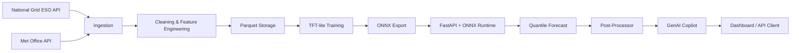

# GridPulse-TFT Documentation

**UK Smart Grid Carbon Intensity Forecaster** — End-to-end TFT-lite pipeline with GenAI dispatch copilot.

## Overview

GridPulse-TFT ingests half-hourly carbon intensity data from National Grid ESO and weather forecasts from UK Met Office, trains a Temporal Fusion Transformer (TFT-lite) multi-quantile model, exports to ONNX, and serves predictions via FastAPI with a generative AI copilot for battery dispatch decisions.

## Key Features

- **Multi-quantile forecasts** (q10, q50, q90) for uncertainty-aware decisions
- **ONNX export** for framework-agnostic, low-latency inference
- **Three-tier fallback**: ONNX → Seasonal naive → 503 degraded
- **GenAI copilot** with 5s timeout, 24h cache, template fallback
- **Resilient ingestion**: retries, atomic writes, deduplication
- **Drift detection**: KS-test alerts on feature distribution shifts

## Quick Links

- [Quickstart Guide](quickstart.md)
- [Full Architecture](ARCHITECTURE.md)
- [API Reference](api.md)
- [Streamlit Dashboard](dashboard.md)

## System Requirements

- Python 3.11+
- 4 GB RAM (training), 1 GB RAM (serving)
- Optional: CUDA GPU for faster training